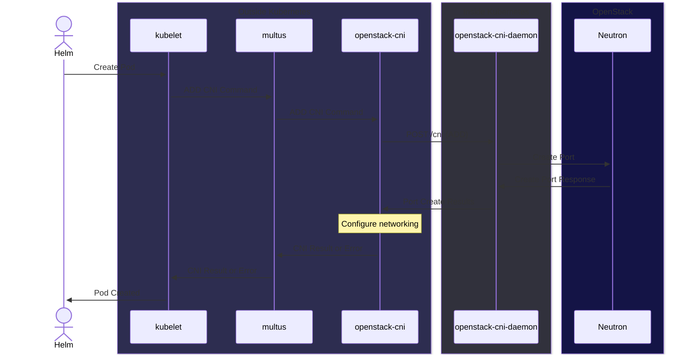

## Sequence Diagrams

### Create Pod (ADD)

```mermaid
sequenceDiagram
    actor Helm
    box rgb(45, 45, 80) Outside Kubernetes
    participant kubelet
    participant multus
    participant openstack-cni
    end
    box rgb(49, 49, 60) Inside Kubernetes
    participant openstack-cni-daemon
    end
    box rgb(20, 20, 70) OpenStack
    participant Neutron
    end
    Helm->>+kubelet: Create Pod
    kubelet->>+multus: ADD CNI Command
    multus->>+openstack-cni: ADD CNI Command
    openstack-cni->>+openstack-cni-daemon: POST /cni (ADD)
    openstack-cni-daemon->>+Neutron: Create Port
    Neutron->>+openstack-cni-daemon: Create Port Response
    openstack-cni-daemon->>+openstack-cni: Port Create Results
    Note over openstack-cni: Configure networking
    openstack-cni->>+multus: CNI Result or Error
    multus->>+kubelet: CNI Result or Error
    kubelet->>+Helm: Pod Created
```

### Delete Pod (DEL)

```mermaid
sequenceDiagram
    actor Helm
    box rgb(45, 45, 80) Outside Kubernetes
    participant kubelet
    participant multus
    participant openstack-cni
    end
    box rgb(49, 49, 60) Inside Kubernetes
    participant openstack-cni-daemon
    end
    box rgb(20, 20, 70) OpenStack
    participant Neutron
    end
    Helm->>+kubelet: Delete Pod
    kubelet->>+multus: DEL CNI Command
    multus->>+openstack-cni: DEL CNI Command
    openstack-cni->>+openstack-cni-daemon: POST /cni (DEL)
    openstack-cni-daemon->>+Neutron: Delete Port
    Neutron->>+openstack-cni-daemon: Delete Port Response
    openstack-cni-daemon->>+openstack-cni: Port Delete Results
    Note over openstack-cni: Unconfigure networking
    openstack-cni->>+multus: CNI Result or Error
    multus->>+kubelet: CNI Result or Error
    kubelet->>+Helm: Pod Deleted
```

