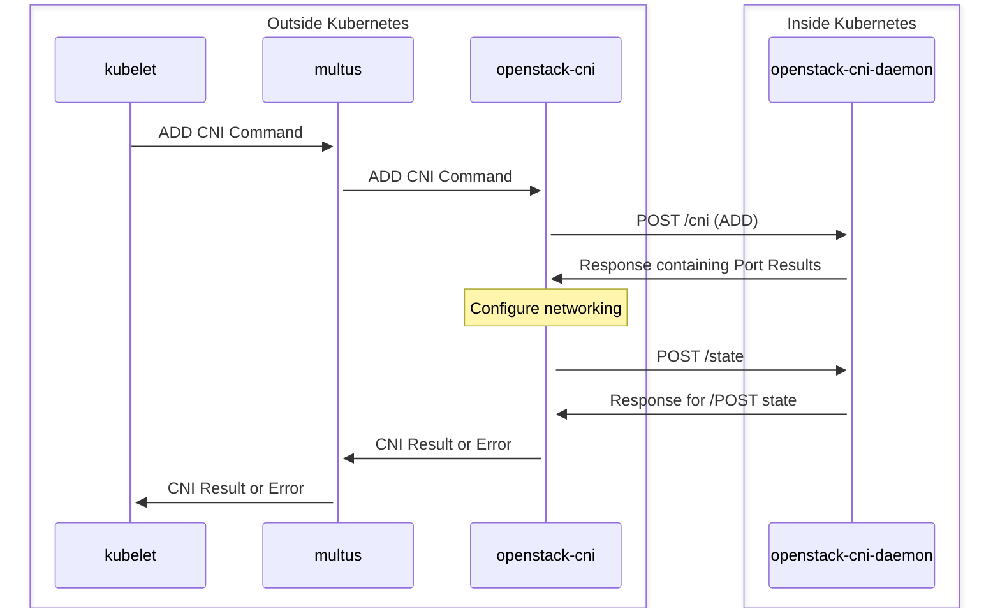
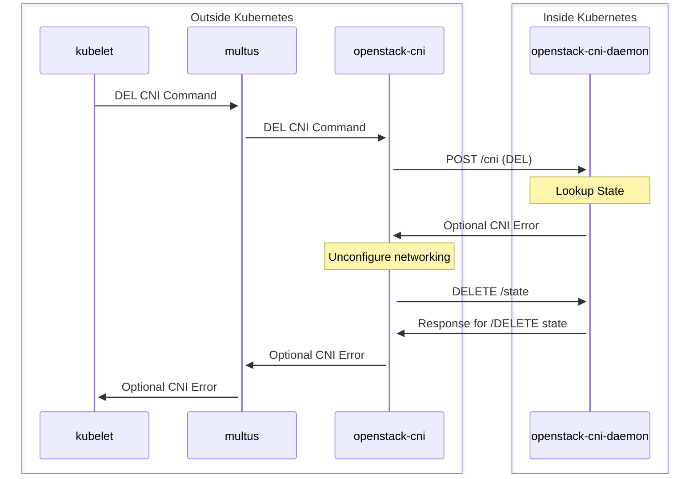

## Sequence Diagrams

### Create container (ADD)

```mermaid
sequenceDiagram
    box Outside Kubernetes
    participant kubelet
    participant multus
    participant openstack-cni
    end
    box Inside Kubernetes
    participant openstack-cni-daemon
    end
    kubelet->>+multus: ADD CNI Command
    multus->>+openstack-cni: ADD CNI Command
    openstack-cni->>+openstack-cni-daemon: POST /cni (ADD)
    openstack-cni-daemon->>+openstack-cni: Response containing Port Results
    Note over openstack-cni: Configure networking
    openstack-cni->>+openstack-cni-daemon: POST /state
    openstack-cni-daemon->>+openstack-cni: Response for /POST state
    openstack-cni->>+multus: CNI Result or Error
    multus->>+kubelet: CNI Result or Error
```

### Teardown container (DEL)

```mermaid
sequenceDiagram
    box Outside Kubernetes
    participant kubelet
    participant multus
    participant openstack-cni
    end
    box Inside Kubernetes
    participant openstack-cni-daemon
    end
    kubelet->>+multus: DEL CNI Command
    multus->>+openstack-cni: DEL CNI Command
    openstack-cni->>+openstack-cni-daemon: POST /cni (DEL)
    Note over openstack-cni-daemon: Lookup State
    openstack-cni-daemon->>+openstack-cni: Optional CNI Error
    Note over openstack-cni: Unconfigure networking
    openstack-cni->>+openstack-cni-daemon: DELETE /state
    openstack-cni-daemon->>+openstack-cni: Response for /DELETE state
    openstack-cni->>+multus: Optional CNI Error
    multus->>+kubelet: Optional CNI Error
```